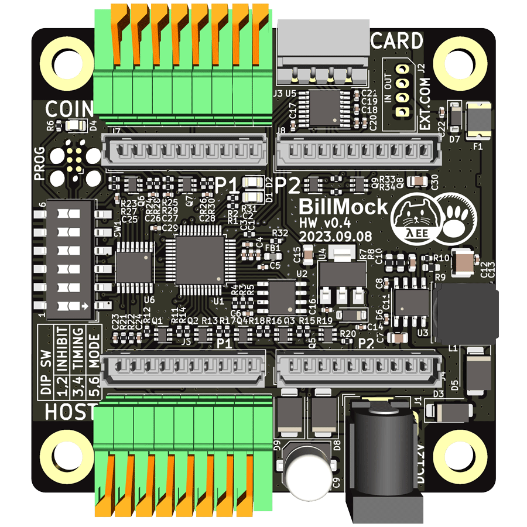
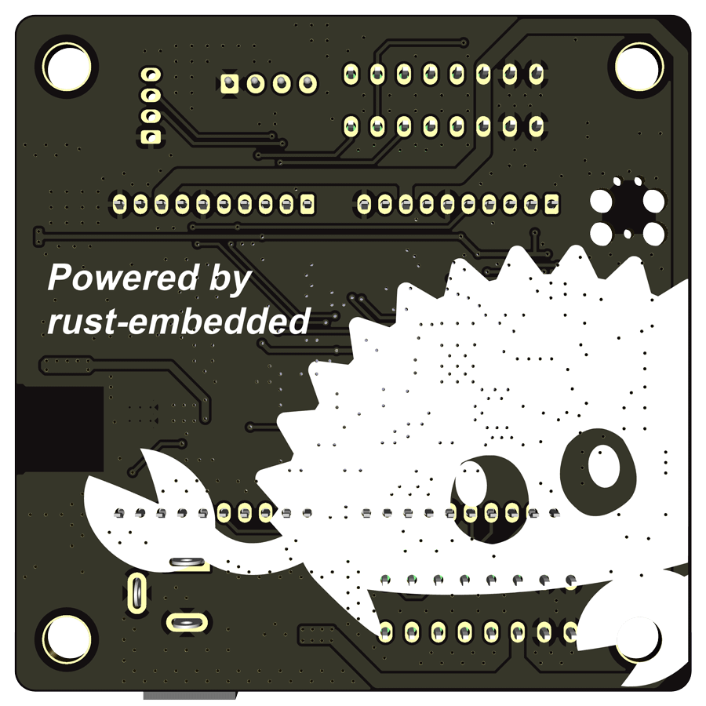
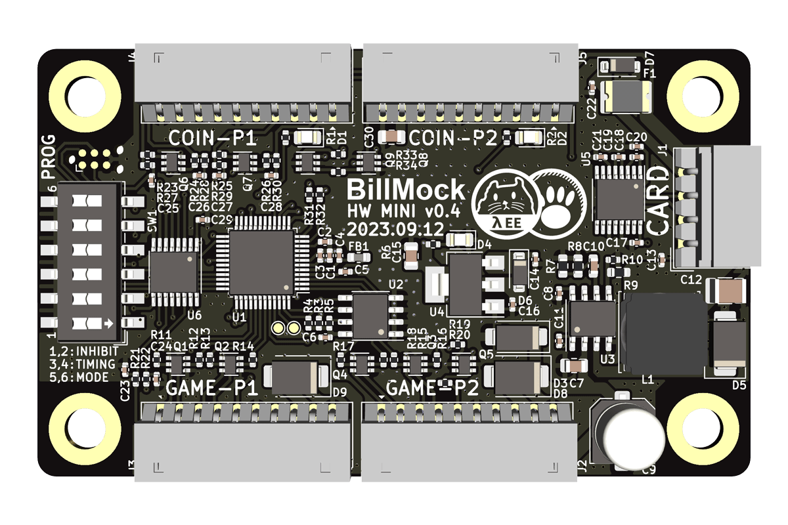
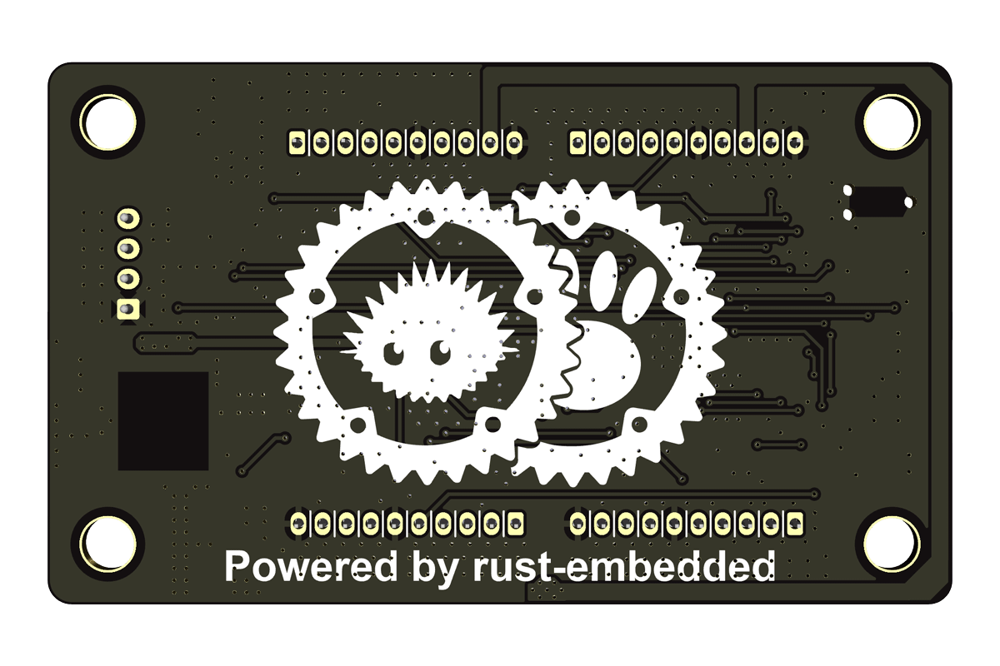
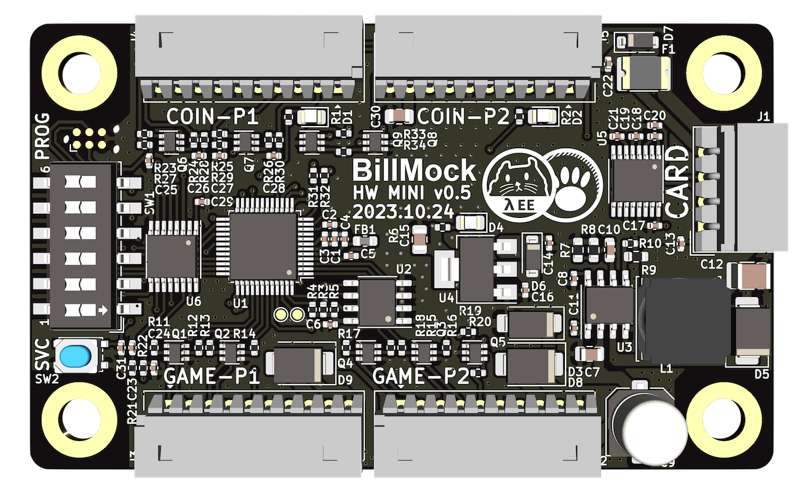

# BillMock-HW-RELEASE
BillMock hardware schematic repository (only pdf)

The schematic printed in PDF is distributed under CC BY-SA 3.0, but the actual Gerber files and project files are private.

## v 0.2 (2023-06-13)
[BillMock-HW-0v2.pdf](sch/BillMock-HW-0v2.pdf)

## v 0.3 (2023-08-11)
[BillMock-HW-0v3.pdf](sch/BillMock-HW-0v3.pdf)

## v 0.4 (2023-09-08)

| top side | bottom side |
| ---- | ---- |
|  |  |

[BillMock-HW-0v4.pdf](sch/BillMock-HW-0v4.pdf)

- EEPROM added

## v 0.4 Mini (2023-09-12)

| top side | bottom side |
| ---- | ---- |
|  |  |

[BillMock-Mini-HW-0v4.pdf](sch/BillMock-Mini-HW-0v4.pdf)

- In comparison to the previous hardware, the size has decreased (65x65 mm -> 75x45 mm), and we have removed infrequently used connectors in the actual usage case. (Mass-production BOM cost considered)
- EEPROM added

## v 0.5 Mini (2023-10-24)

| top side | bottom side |
| ---- | ---- |
|  |  |

[BillMock-Mini-HW-0v5.pdf](sch/BillMock-Mini-HW-0v5.pdf)

- Tact Switch added added

## SWD Debugger Adapter
[Schematic - BillMock-SWDAdapter-HW.pdf](sch/BillMock-SWDAdapter-HW.pdf)

More information or gerbers files here [Debug Adapter](./debug.md)
