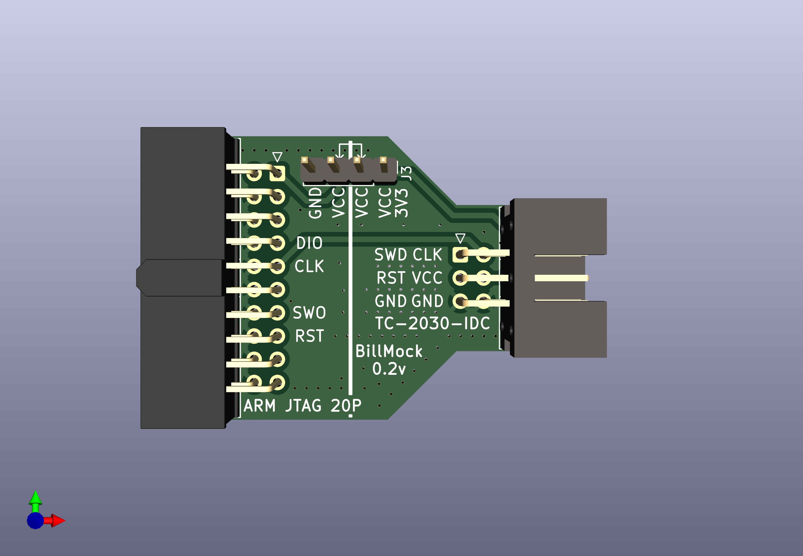
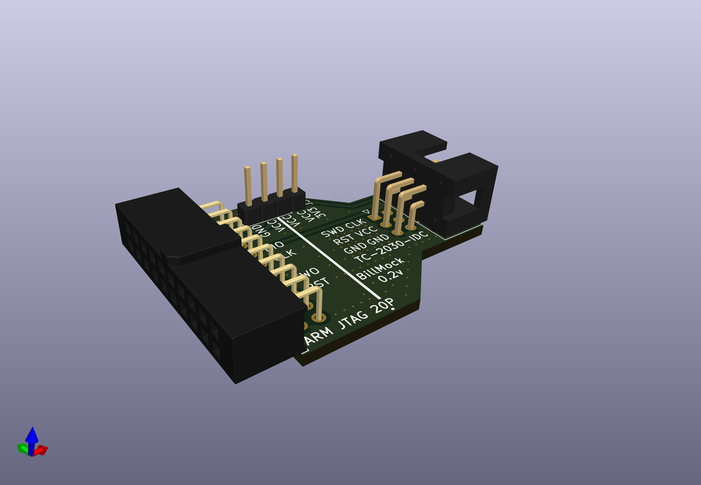
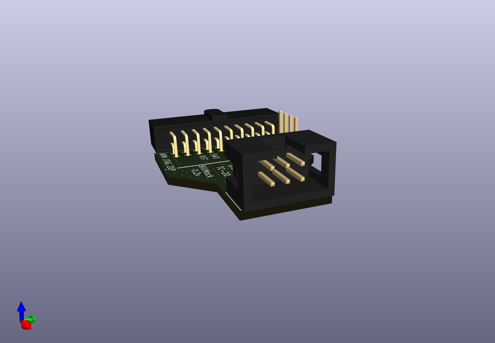

# BillMock SWD Adapter

| Front | Left | Right |
| ----- | ---- | ----- |
|  |  |  |

## Schematic for SWD Adapter
[Sch File](./sch/BillMock-SWDAdapter-HW.pdf)

## Gerber File for SWD Adapter
[Gerber File](./gerber-open/BillMock-SWDAdapter-HW.zip)

## Usage
Just insert the board to STLINK
